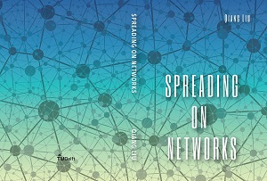

<table>
<tr>
<td></td>
<td><strong>刘强</strong> (<a href="https://scholar.google.com/citations?user=qNGI9gEAAAAJ" target="_blank" rel="noopener noreferrer">Google Scholar</a>|<a href="https://www.researchgate.net/profile/Qiang_Liu109" target="_blank" rel="noopener noreferrer">ResearchGate</a>|<a href="https://www.nas.ewi.tudelft.nl/index.php/qiang-liu" target="_blank" rel="noopener noreferrer">Page in TU Delft</a>)

<em>Email: Q.L.Liu(a)hotmail.com</em>

<em>Tel: +31 06455 78850</em>

<em>Addr: EWI HB 09.040, Mekelweg 4, 2628 CD, Delft, The Netherlands</em>

</td>
</tr>
</table>
<h3><strong>Education:</strong></h3>
<ul>
<li>2015-2019, Ph.D. (defense date 10.31 at 10:00), Delft University of Technology, supervised by <a href="https://www.nas.ewi.tudelft.nl/people/Piet/" target="_blank" rel="noopener noreferrer">Prof. Piet Van Mieghem</a>.</li>
<li>2012-2015, M.Sc. (Cryptography), University of Electronic Science and Technology of China.</li>
<li>2008-2012, B.E. (Communication Engineering), University of Electronic Science and Technology of China.</li>
</ul>
<!--<h3><strong>Research Interest:</strong></h3>

The secrets of nature.
-->
<h3><strong>Dissertation:</strong></h3>

<a href="/publications/Dissertation Qiang Liu.pdf" target="_blank" rel="noopener noreferrer">Spreading on Networks</a>   

<h3><strong>Publications:</strong></h3>
<ul>
<li>L.Ma, <strong>Q. Liu</strong> and P. Van Mieghem, 2019, "<a href="https://www.nas.ewi.tudelft.nl/people/Piet/papers/AppliedNetworkScience2019_Inferring_properties_prevalence.pdf" target="_blank" rel="noopener noreferrer">Inferring network properties based on the epidemic prevalence</a>", Applied Network Science, to appear.</li>
<li>P. Van Mieghem and <strong>Q. Liu</strong>, "<a href="http://homepage.tudelft.nl/7e71w/publication/PhysRevE2019_Non_Markovian_SIS_gamma_weibull_lognormal.pdf" target="_blank" rel="noopener noreferrer">Explicit non-Markovian susceptible-infected-susceptible mean-field epidemic threshold for Weibull and Gamma infections but Poisson curings</a>", Physical Review E 100, 022317, Aug. 2019.</li>
<li>Y. Xu, Y. Si, J. Takekawa, <strong>Q. Liu</strong>, H. H. T. Prins, S. Yin, D. Prosser, P. Gong and W. F. de Boer, "<a href="https://onlinelibrary.wiley.com/doi/pdf/10.1111/cobi.13383" target="_blank" rel="noopener noreferrer">A network approach to prioritize conservation efforts for migratory birds</a>", Conservation Biology, 2019, to appear.</li>
<li><strong>Q. Liu</strong>, X. Zhou and P. Van Mieghem, "<a href="/publications/EPL2019_pulseSIS_strategy.pdf" target="_blank" rel="noopener noreferrer">Pulse strategy for suppressing spreading on networks</a>," EPL (Europhysics Letters) 127, 38001, Aug. 2019.</li>
<li><strong>Q. Liu</strong> and P. Van Mieghem, "<a href="https://arxiv.org/pdf/1810.04880.pdf" target="_blank" rel="noopener noreferrer">Network localization is unalterable by infections in bursts</a>," IEEE Transactions on Network Science and Engineering, <a href="https://arxiv.org/abs/1810.04880" target="_blank" rel="noopener noreferrer">arXiv:1810.04880</a>, Dec. 2018, to appear.</li>
<li><strong>Q. Liu</strong> and P. Van Mieghem, "<a href="/publications/PhysRevE2018_SIS_autocorrelation.pdf" target="_blank" rel="noopener noreferrer">Autocorrelation of the susceptible-infected-susceptible process on networks</a>," Phys. Rev. E 97, 062309, June 2018. </li>
<li><strong>Q. Liu</strong> and P. Van Mieghem, "<a href="/publications/PhysRevE2018_largest_non_Markovan_threshold.pdf" target="_blank" rel="noopener noreferrer">Burst of virus infection and a possibly largest epidemic threshold of non-Markovian susceptible-infected-susceptible processes on networks</a>," Phys. Rev. E 97, 022309, Feb. 2018. [<a href="http://audiovideocast.univ-lyon2.fr/avc/courseaccess?id=1781" target="_blank" rel="noopener noreferrer">video</a>]</li>
<li><strong>Q. Liu </strong>and P. Van Mieghem, "<a href="/publications/PhysicaA2017_tanh_comparison.pdf" target="_blank" rel="noopener noreferrer">Evaluation of an analytic, approximate formula for the time-varying SIS prevalence in different networks</a>," Physica A, vol.471, pp. 325-336, Apr. 2017.</li>
<li><b>Liu, Q. </b>and P. Van Mieghem, "<a href="/publications/Workshop_Complex_Networks2016_Die-out_probability.pdf" target="_blank" rel="noopener noreferrer">Die-out Probability in SIS Epidemic Processes on Networks</a>", Fifth International Workshop on Complex Networks and their Applications, Milan, Italy, Nov 30 - Dec 2, 2016.</li>
<li>Guo, J.; Shi, Z.; Liu, Z.; Zhang, Z.; <strong>Liu, Q.</strong>, "<a href="http://homepage.tudelft.nl/7e71w/publication/2016-IEEE%20Comm.%20Lett.-Multi-CRC%20Polar%20Codes%20and%20Their%20Applications.pdf" target="_blank" rel="noopener noreferrer">Multi-CRC Polar Codes and Their Applications</a>," IEEE Communications Letters, vol.20, no.2, pp.212-215, Feb. 2016.</li>
</ul>
<h3><strong>Talks:</strong></h3>
<ul>
<li>Lake Como School of Advanced Studies: Complex Networks: Theory, Methods, and applications, "Network localization is unalterable by infections in bursts", Como, Italy, May 13-17, 2019.[<a href="/talks/NTME.pdf" target="_blank" rel="noopener noreferrer">slide</a>]</li>
<li>Pengcheng laboratory, "The story of networks" (Poster), Shenzhen, China, Mar. 31, 2019.</li>
<li>VU Medical Center clinical neurophysiology group meeting, "Recently developed methods for networked data", Amsterdam, Nov. 26, 2018.</li>
<li>NetSciX18, Hangzhou, China, Jan 5-8, 2018. [<a title="Synchronized SIS process and a possibly largest non-Markovian threshold" href="/talks/NetSciX18Hangzhou.pdf" target="_blank" rel="noopener noreferrer">slide</a>]</li>
<li>6th International Conference on Complex Networks and their Applications, Lyon, France, Nov 29 - Dec 1, 2017. [<a title="Synchronized SIS process and a possibly largest non-Markovian threshold" href="/talks/complexnetworks17Lyon.pdf" target="_blank" rel="noopener noreferrer">slide</a>][<a href="http://audiovideocast.univ-lyon2.fr/avc/courseaccess?id=1781" target="_blank" rel="noopener noreferrer">video</a>]</li>
<li>5th International Workshop on Complex Networks and their Applications, Milan, Italy, Nov 30 - Dec 2, 2016.</li>
<li>"On the Accuracy of Time-dependent NIMFA Prevalence of SIS Epidemic Process", <a href="http://www.ccs2016.org" target="_blank" rel="noopener noreferrer">Conference on Complex Systems 2016</a>, Amsterdam, the Netherlands, Sep. 19-22, 2016.</li>
</ul>
<h3><strong>Referee for:</strong></h3>
<ul>
<li>IEEE Transactions on Computational Social Systems; Physica A; Scientific Report; IEEE Control Systems Letters; IEEE Transactions on Network Science and Engineering; Computer Physics Communications; IEEE Transactions on Evolutionary Computation; Journal of Complex Networks. </li>
<li>USRR 16; American Control Conference 2019.</li>
</ul>
<h3><strong>Master thesis supervision:</strong></h3>
<ul>
<li>Non-Markovian epidemic process on networks, Xiaoyu Zhou (started Feb. 2019)</li>
<li>Modeling Influenza on networks, Aziz Hamad (Joint supervision with Long Ma, defended at 2018.12.20)</li>
<li>Network cut and epidemics, Yingli Ni (defended at 2017.08.29)</li>
</ul>
<h3><strong>Interesting nodes in WWW:</strong></h3>
<ul>
<li><a href="http://www.complexity-explorables.org/" target="_blank" rel="noopener noreferrer">Complexity Explorables</a></li>
<li><a href="http://www.ph.ucla.edu/epi/snow.html" target="_blank" rel="noopener noreferrer">John Snow - a historical giant in epidemiology</a></li>
<li><a href="http://www.feynmanlectures.caltech.edu/" target="_blank" rel="noopener noreferrer">The Feynman Lectures on Physics</a></li>
<li><a href="http://www.openproblemgarden.org/" target="_blank" rel="noopener noreferrer">Open Problem Garden</a></li>
<li><a href="http://konect.uni-koblenz.de/" target="_blank" rel="noopener noreferrer">The Koblenz Network Collection</a></li>
<li><a href="http://snap.stanford.edu/" target="_blank" rel="noopener noreferrer">Stanford Network Analysis Project</a></li>
<li><a href="http://web-graph.org/" target="_blank" rel="noopener noreferrer">Erdős WebGraph</a></li>
<li><a href="http://brauer.maths.qmul.ac.uk/Atlas/v3/" target="_blank" rel="noopener noreferrer">ATLAS of Finite Group Representations</a></li>
<li><a href="http://oeis.org/?language=english" target="_blank" rel="noopener noreferrer">The On-Line Encyclopedia of Integer Sequences</a></li>
<li><a href="http://www.if.pw.edu.pl/~agatka/catalogue/main.html" target="_blank" rel="noopener noreferrer">CRITICAL EVENTS in COMPLEX NETWORKS</a></li>
<li><a href="http://www-personal.umich.edu/~mejn/netdata/" target="_blank" rel="noopener noreferrer">Mark Newman's network data</a></li>
<li><a href="https://idea-instructions.com/" target="_blank" rel="noopener noreferrer">IDEA - An ongoing series of nonverbal algorithm assembly instructions</a></li>
<li><a href="http://netwonder.net/" target="_blank" rel="noopener noreferrer">WonderNet - (Virtual) Physicality of Networks</a></li>
</ul>
